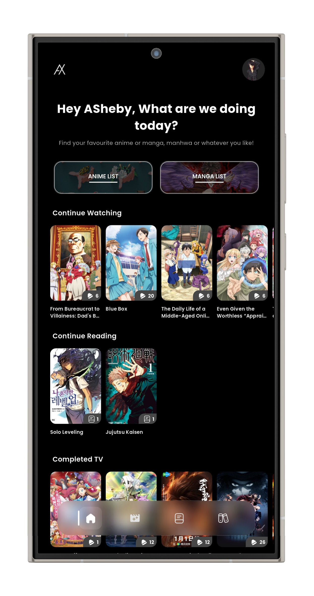
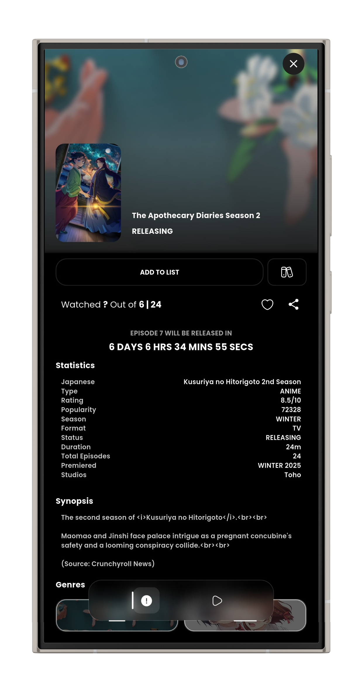
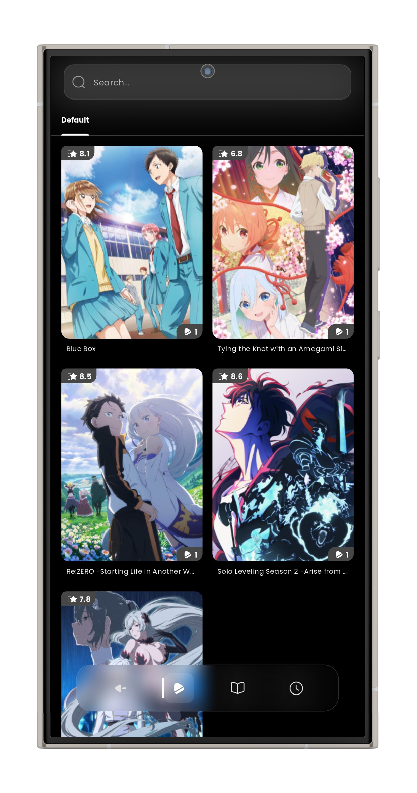

   

   
  

  <!---->

# AnymeX
**AnymeX** is a multiservice tracking client, with [**AniList**](https://anilist.co/), [**MyAnimeList**](https://myanimelist.net/) & [**Simkl**](https://simkl.com/) support!

## Downloads

   
   

### iOS Sideloading Sources

	

		
		
		
		
	

## Disclaimer
- **Purpose**: AnymeX is a hybrid tracking and management tool for anime, manga and other media supported by AniList, MyAnimeList & Simkl. This application is designed for tracking use only.
- **Content Policy**: AnymeX does not provide, maintain, or host streaming extensions or copyrighted content.
- **Responsibility**: Users are responsible for their actions. The developer disclaims all liability for misuse, including legal issues with third-party content or external sources. Any legal action should be taken against the providers of extensions, not AnymeX.

## Screenshots

| Home | Search | Details | Library |
| ------- | ------- | ------ | ------- |
| |  |  |  |

<!-- Once I make the screenshots I'll add this back
### 💻 Desktop

    
    

-->

## Support Us

> ⭐ **Star This Repository To Support The Developer And Encourage The Development Of The Application!**

  
Star History

  

## Official Communities
Join our communities to stay updated and contribute to the discussion:

## Contribute
We welcome contributions, from translations to new features. For inquiries, join our [Discord server](https://discord.gg/5gAHhMvTcx) or [Telegram group](https://t.me/AnymeX_Discussion). Pull requests are welcome; check the [open issues](https://github.com/RyanYuuki/AnymeX/issues) for guidance on major changes.

<!--

Weblate Translation Graph

-->

## Acknowledgments
A heartfelt thank you to everyone who has contributed to the development of AnymeX.
Your efforts are invaluable.

 

## License
AnymeX is licensed under the MIT License. More info can be found [here](LICENSE.md).
